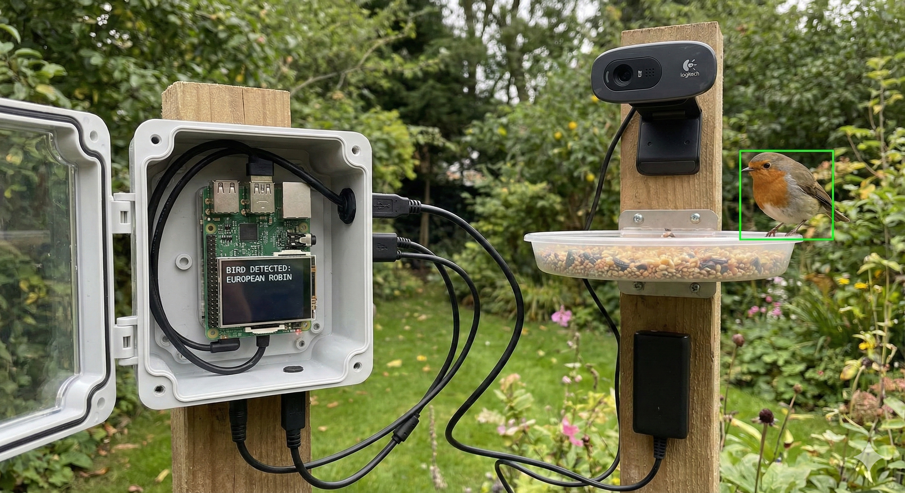
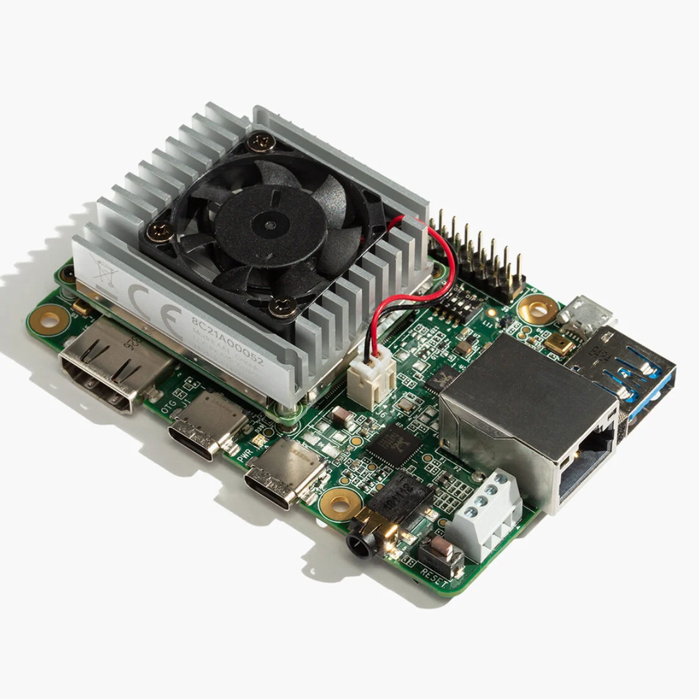

# 🦅 Edge AI Vogelclassificatie: NABirds op Coral Dev Board

[](https://www.python.org/downloads/)
[](https://www.tensorflow.org/)
[](https://coral.ai/docs/dev-board/get-started/)
[](https://coral.ai/products/dev-board/)

<div align="center">
<a href="https://github.com/WarreVanRechem/aiproject">
  
</a>
<br>
<small><em>(Opmerking: AI gegenereerde afbeelding)</em></small>
</div>

## 🎯 Projectopdracht

De kern van dit project was het ontwikkelen van een intelligent embedded systeem dat objecten (specifiek vogels) kan herkennen in real-time videobeelden. De opdracht omvatte de volledige machine learning pijplijn, van data-analyse tot hardware-deployment op een Edge TPU.

De specifieke vereisten waren:
* **Model Development:** Het bouwen en trainen van een TensorFlow-model (lokaal/cloud).
* **Optimalisatie:** Conversie naar **TensorFlow Lite** voor gebruik op embedded hardware.
* **Deployment:** Implementatie op een **Coral Dev Board (Edge TPU)**.
* **Real-time Verwerking:** Het systeem moet live camerabeelden analyseren.
* **Visuele Feedback:** De output (herkende objecten + accuracy) moet direct getoond worden via hardware (LCD) en software (webinterface).

Het eindresultaat is een werkend prototype dat autonome beeldanalyse uitvoert, waarbij de AI-logica gescheiden draait van de visualisatie voor maximale prestaties.

---

## 👥 Het Team

Voor dit project hebben we de taken verdeeld op basis van technische expertise, met een splitsing tussen AI/Software-backend en Hardware-integratie.

### Model & Software Backend
*Verantwoordelijk voor het neurale netwerk, TF Lite conversie en de applicatielogica.*

* **Daan** (Modeltraining, Setup Camera,Hardware, Flask & TF Lite)
    * Opbouw van de TensorFlow modelstructuur.
    * Trainen van het groote Nabirds model
    * Conversie en optimalisatie van het model naar TensorFlow Lite voor de Edge TPU.
    * Ontwikkeling van de Flask applicatie en multithreading voor video-streaming naar de PC.
    * Implementatie van de camera-drivers en beeldverwerking.
    * Dataset selectie
* **Warre** (Model Training, Flask, TF Lite & Tuning)
    * Samenstellen en structureren van het TensorFlow model.
    * Trainen van het model over meerdere epochs en parameter-tuning.
    * Ondersteuning bij de TF Lite conversie.
    * Ontwikkeling van de Flask applicatie en multithreading voor video-streaming naar de PC.
    * Dataset selectie

### Hardware & Peripherals
*Verantwoordelijk voor de fysieke setup, I/O en hardware-visualisatie.*

* **Quinten** (Hardware & LCD)
    * Initialisatie en configuratie van het Coral Dev TPU board.
    * Opzetten van I2C-communicatie.
    * Implementatie van de visuele output op het LCD-scherm.
* **Robin** (Hardware & LCD, Support & Evaluatie)
    * Assistentie bij het trainen en evalueren van de model-accuracy.
    * Ondersteuning bij de hardware-setup en tests.
    * Opzetten van I2C-communicatie.
    * Implementatie van de visuele output op het LCD-scherm.

---

## 📋 Benodigdheden & Voorbereiding

Voordat je begint, zorg dat je de volgende hardware en software klaar hebt staan.

### 🛒 Hardware
* **Coral Dev Board** (1GB of 4GB versie).
* **Webcam:** Logitech C270 (of een andere USB-camera compatible met Linux).
* **Host Computer:** Windows 10/11, macOS of Linux (om het model te trainen).
* **USB-C Kabels:**
    * 1x voor stroom (2-3A adapter aanbevolen).
    * 1x voor data (Host PC naar 'OTG' poort).
* **MicroSD kaart:** (Minimaal 8GB, nodig voor het flashen van het bord).
* **Internetverbinding:** Wifi of Ethernet voor de Coral.

### 💻 Software (Host PC)
Op je computer heb je het volgende nodig:
* [Python 3.7+](https://www.python.org/downloads/)
* [Google Coral MDT (Mendel Development Tool)](https://coral.ai/docs/dev-board/get-started/#3-install-mdt) - *Cruciaal voor communicatie met het bord.*
* [Edge TPU Compiler](https://coral.ai/docs/edgetpu/compiler/) - *Nodig om het model te vertalen voor de Coral chip.*
    * *Let op: De compiler werkt native alleen op Linux. Gebruik [Google Colab](https://colab.research.google.com/) als je op Windows/Mac werkt.*

### ⚙️ Staat van de Coral Dev Board
Dit project gaat ervan uit dat je Coral al "up-and-running" is:
1.  **Geflashed:** Mendel Linux is geïnstalleerd. ([Handleiding](https://coral.ai/docs/dev-board/get-started/#2-flash-the-board))
2.  **Verbonden:** Je kunt verbinden via MDT (`mdt shell`).
3.  **Online:** Het bord heeft internettoegang.


---

## ⚙️ Hardware Architectuur

De kern van dit project is de **Coral Dev Board**, een Single Board Computer (SBC) die specifiek is ontworpen voor snelle ML-inferentie.

* **Host Systeem:** Een krachtige PC/Laptop (voor het trainen van het model).
* **Target Device:** Coral Dev Board (voor het uitvoeren van het model).
* **Accelerator:** De geïntegreerde Edge TPU coprocessor, die tot 4 biljoen operaties per seconde (TOPS) kan uitvoeren met een minimaal stroomverbruik.

<div align="center">
<a href="https://github.com/WarreVanRechem/aiproject">
  
</a>
</div>

---

## 📂 Overzicht van deze Repository

Deze repository bevat scripts voor zowel de trainingsfase (Host PC) als de inferentiefase (Dev Board).

## 🦜 Dataset Ophalen

Voor dit project maken we gebruik van de **NABirds V1** dataset van het Cornell Lab of Ornithology.

1. **Downloaden:**
   Ga naar de [NABirds downloadpagina](https://dl.allaboutbirds.org/nabirds) en vraag de dataset aan.
   
2. **Plaatsen:**
   Plaats het gedownloade bestand (`nabirds.tar.gz`) in de root van dit project of in een map genaamd `data/`.

3. **Uitpakken:**
   Gebruik de terminal of 7-ZIP om het archief uit te pakken:
   <a href="https://github.com/WarreVanRechem/aiproject">
  
   </a>

   of     
   ```bash
   # Maak een map aan op de gewenste locatie (optioneel)
   mkdir -p dataset
   
   # Verplaats het bestand (indien nodig) en pak uit
   tar -xvzf nabirds.tar.gz -C data/
   ```

### 🛠 Fase 1: Data Voorbereiding & Training (Host PC)

Deze scripts worden uitgevoerd op een krachtige computer om het model te bouwen:

* **`prepare_dataset.py`**
    De originele NABirds dataset is "rommelig" voor een AI-model: alle afbeeldingen staan in diepe mappenstructuren met ID-nummers, en er zijn duizenden vogels die je niet nodig hebt. Dit script pakt alleen de 8 vogels die wij gebruiken en zet ze netjes klaar dit komt omdat de volledige dataset te groot is.
    <br>
* **`fix_dataset.py`**
  Dit script fungeert als kwaliteitscontrole. Het scant de gedownloade afbeeldingen op corruptie en verwijdert bestanden die niet leesbaar zijn voor TensorFlow, wat crashes tijdens het trainen voorkomt. Daarnaast kun je dit script gebruiken om de selectie van vogels aan te passen, zonder dat je de eerdere voorbereidingsstappen (`prepare_dataset.py`) volledig opnieuw hoeft te doorlopen.
  <br>
* **`fix_labels.py`**
    Dit eenvoudige, maar cruciale script zorgt voor de correcte mapping tussen de mapnamen (de vogelsoorten) en de numerieke uitgangen van het AI-model.<br><br>

    1. Leest Mappen: Het script scant de map coral_dataset/train en verzamelt de namen van alle vogelsoorten die je hebt geselecteerd.

    2. Sorteert: Het sorteert de vogelnamen alfabetisch. Dit is de volgorde die het machine learning-raamwerk (TensorFlow/TensorFlow Lite) automatisch zal gebruiken.

    3. Genereert labels.txt: Het schrijft de gesorteerde namen naar het bestand labels.txt.<br><br>

    Dit bestand dient als de "vertaler" voor je getrainde model. Als het model tijdens de detectie een output van bijvoorbeeld '3' geeft, vertelt `labels.txt` dat '3' overeenkomt met de vierde vogelsoort in de alfabetische lijst (index start bij 0). Dit voorkomt een 'label-mix-up' waarbij het model wel de juiste categorie voorspelt, maar het systeem de verkeerde naam toont.
    <br>
* **`train_model.py`**
    Dit is het hoofdscript dat de machine learning uitvoert en het model voor de Coral optimaliseert.<br><br>

    1. Data Inladen en Verharden: Het laadt de reeds gesorteerde vogelafbeeldingen in. Het past strenge data-augmentatie toe (zoomen, draaien, contrast) om het model robuust te maken voor wisselende omstandigheden buiten.

    2. Transfer Learning: Het gebruikt het snelle, lichte MobileNetV2-model, dat al is getraind op miljoenen afbeeldingen (ImageNet). Alleen de laatste laag wordt aangepast om te classificeren tussen jouw 8 vogels.

    3. Training: Het model wordt getraind (6 epochs) op de geaugmenteerde data om de vogelsoorten te leren herkennen.

    4. Optimalisatie voor Coral (Kwantisatie): Dit is de cruciale stap. Het getrainde model wordt geconverteerd naar het TensorFlow Lite (TFLite)-formaat en geoptimaliseerd met Int8 Kwantisatie.

    5. Deze kwantisatie maakt het model veel kleiner en zorgt ervoor dat de Edge TPU (de AI-chip op de Coral) het model honderden keren sneller kan uitvoeren.<br><br>

    **Output**: Het resultaat is het bestand nabirds_strict_quant.tflite, het geoptimaliseerde model dat klaar is voor inzet op de Coral Dev Board.

    **Kortom**: Dit script traint een slim, robuust vogelherkenningsmodel en maakt het ultrasnel door het te optimaliseren voor de Edge TPU van de Coral.

### 🧪 Fase 2: Validatie (Host PC)

* **`test_flite_model_pc.py`**
    Draait het geconverteerde `.tflite` model op de CPU van je PC om de nauwkeurigheid te verifiëren vóór deployment.
    Dit script bevestigt dat het geoptimaliseerde TFLite-model functioneel is en garandeert, dankzij de smoothing, dat het systeem een betrouwbare en stabiele classificatie zal bieden wanneer het straks naar de Coral Dev Board wordt overgezet.
    <br>
* **`web_test.py`**
    Een web-interface (bijv. Flask) om het model lokaal in de browser te testen met geüploade afbeeldingen.

### 🚀 Fase 3: Productie (Coral Dev Board)

Deze bestanden draaien op de Dev Board zelf:

* **`nabirds_strict_quant_edgetpu.tflite`**
    Het eindproduct: het gekwantiseerde model, gecompileerd voor de Edge TPU.
* **`coral_vol_code.py`**
    De productie-code. Dit script laadt het model in de TPU, leest de camerabeelden of bestanden in, en voert de detectie uit.
* **`labels.txt`**
    De lijst met vogelnamen die overeenkomen met de output van het model.

---

## 🚀 Installatie & Gebruik

### Stap 1: Omgeving opzetten (Host PC)

Zorg dat Python 3 geïnstalleerd is en installeer de benodigde libraries voor het trainen:
```bash
pip install tensorflow numpy pillow matplotlib opencv-python
```

### Stap 2: Data Voorbereiden

Voer de scripts in deze volgorde uit om je dataset klaar te maken:

```bash
    # 1. Download en sorteer de relevante vogels
    python prepare_dataset.py

    # 2. Controleer op corrupte bestanden
    python fix_dataset.py

    # 3. Genereer de juiste labels.txt
    python fix_labels.py
```

### Stap 3: Model Trainen

Start de training. Dit kan enkele minuten tot uren duren, afhankelijk van je computer.

```bash
    python train_model.py
```
Resultaat: Je hebt nu een bestand genaamd nabirds_strict_quant.tflite.

### Stap 4: Compileren voor Edge TPU

Dit is een cruciale stap. Het .tflite bestand werkt nu alleen nog op een CPU. Om de kracht van de Coral te gebruiken, moet het gecompileerd worden.

Heb je de Edge TPU Compiler geïnstalleerd [(installatie)](https://www.coral.ai/docs/edgetpu/compiler#system-requirements)? 
Voer dan uit:

```bash
    edgetpu_compiler nabirds_strict_quant.tflite
```
Resultaat: Je krijgt een nieuw bestand: nabirds_strict_quant_edgetpu.tflite. Dit is het bestand dat we nodig hebben!
    - Geen Linux/Compiler? Je kunt deze stap ook uitvoeren in [Google Colab (web-based)](https://colab.research.google.com/github/google-coral/tutorials/blob/master/compile_for_edgetpu.ipynb).

### Stap 5: Bestanden overzetten met MDT

Google raadt aan om de `mdt` (Mendel Development Tool) te gebruiken om bestanden van je PC naar de Coral te sturen.

1.  Zorg dat je via USB verbonden bent met de Coral en dat `mdt` op je PC geïnstalleerd is.
2.  Navigeer op je PC naar de map met je projectbestanden.
3.  Push de bestanden naar de Coral:

```bash
# Push het model, de labels en het script
mdt push nabirds_strict_quant_edgetpu.tflite
mdt push labels.txt
mdt push coral_vol_code.py
```

### Stap 6: Installatie op de Coral (via MDT Shell)

Nu gaan we 'in' de Coral om de software te installeren.

1. Open de terminal van de Coral:
    ```bash
    mdt shell
    ```
    (Je ziet nu dat je prompt verandert naar mendel@...)
<br>

2. Update de software (zoals aanbevolen in de Coral handleiding):

    ```bash
    sudo apt-get update
    sudo apt-get dist-upgrade
    ```

3. Installeer de specifieke benodigde pakketten voor ons project:

    ```bash
    # Flask voor de webserver en OpenCV voor de camera
    sudo apt-get install python3-opencv python3-flask

    # Zorg dat de Edge TPU drivers up-to-date zijn
    sudo apt-get install libedgetpu1-std
    ```

### Stap 7: starten maar

Alles staat klaar op de Coral. Zorg dat je nog steeds in de mdt shell zit en voer uit:

```bash
python3 coral_vol_code.py
```
Het systeem start nu op.

Webstream: Ga op je PC naar het IP-adres van de Coral (poort 5000).

Tip: Typ `ip a` in de shell om het IP-adres van de Coral te vinden als je dat niet weet.

URL voorbeeld: http://192.168.100.2:5000

### Stap 8: Script automatisch laden bij opstart (Headless)

Om het Coral Dev Board volledig autonoom te maken, gebruiken we Systemd om het Python script als een achtergrondservice te draaien zodra het bord stroom krijgt.

1. Maak de service file aan: Open een editor op de Coral:
```bash
sudo nano /etc/systemd/system/bird-classifier.service
```

2. Voeg de configuratie toe: 
Plak onderstaande tekst in het bestand. Let op: Pas de paden aan als je bestandsstructuur anders is.
```bash
[Unit]
Description=Bird Classifier Edge TPU Service
After=network.target

[Service]
User=mendel
WorkingDirectory=/home/mendel/bird_project
ExecStart=/usr/bin/python3 /home/mendel/bird_project/project_top3.py
Restart=always
RestartSec=10

[Install]
WantedBy=multi-user.target
```

3. Activeer de service: 
Voer de volgende commando's uit om de service te registreren en direct te starten:

```bash
sudo systemctl daemon-reload
sudo systemctl enable bird-classifier.service
sudo systemctl start bird-classifier.service
```

4. Controleer de status:

```bash
sudo systemctl status bird-classifier.service
```
Als er `Active: active (running)` staat, is de installatie geslaagd!

### 📊 Resultaten Testrun
Tijdens de laatste testsessie (zie logs 16 dec 2025) functioneerde het systeem volledig autonoom.

* **Status:** Service startte succesvol na reboot.
* **Webserver:** Bereikbaar op `0.0.0.0:5000`.
* **LCD:** Initialiseerde correct ("LCD Succesvol Geïnitialiseerd").

**Detecties:**
Het model detecteerde en classificeerde succesvol de volgende soorten in real-time:
* Dark-eyed Junco (Pink-sided)
* Bald Eagle (Meerdere opeenvolgende frames, totaal 8x geteld)
* Snow Goose
* Black-necked Stilt
* Verdin
* Hooded Oriole
* Redhead
* Song Sparrow  